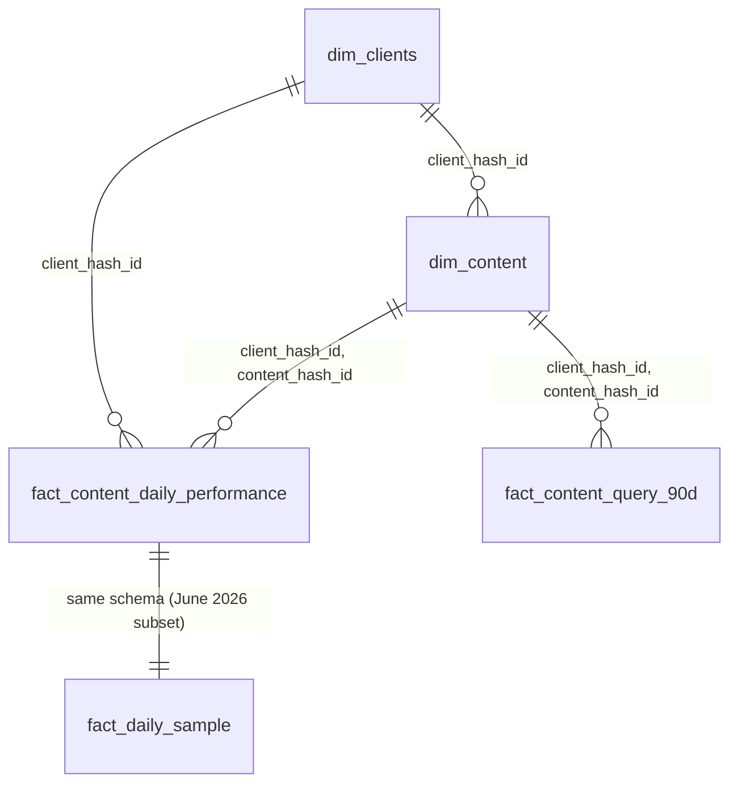

# Data Inventory — FlyRank Internship Warehouse

> **Dataset:** `FlyRank/internship-warehouse` on Hugging Face (gated)
> **Snapshot:** v20260703 (frozen export date 2026-07-03)
> **Total rows:** 93,463,685 across 5 tables
> **Schema:** Star schema with salted, namespaced, fingerprinted hash keys

---

## Table Overview

| Table | Rows | Cols | Grain | Notes |
|-------|-----:|-----:|-------|-------|
| `dim_clients` | 104 | 9 | One row per client | 84 active in content, 70 in facts |
| `dim_content` | 519,606 | 26 | One row per content piece | Keyword/URL metadata, search volume, intent |
| `fact_content_daily_performance` | 78,835,655 | 31 | Client × Content × Day | **Core fact table.** Hive-partitioned by month (18 months) |
| `fact_content_query_90d` | 2,414,248 | 21 | Client × Content × Query | 90-day query-level aggregation (single window) |
| `fact_daily_sample` | 11,694,072 | 31 | Client × Content × Day | Sample (June 2026 only). Same schema as full fact table |

---

## dim_clients (104 rows, 9 columns)

| Column | Type | Nulls | Notes |
|--------|------|------:|-------|
| `client_hash_id` | VARCHAR | 0 | PK. 104 unique |
| `is_active` | BOOLEAN | 10 (9.6%) | |
| `has_gsc_access` | BOOLEAN | 10 (9.6%) | |
| `has_ga4_access` | BOOLEAN | 10 (9.6%) | |
| `access_profile` | VARCHAR | 0 | 5 values: gsc_and_ga4 (53), no_access (26), gsc_only (14), source_only (10), ga4_only (1) |
| `client_created_date` | DATE | 10 (9.6%) | 2025-05-26 → 2026-06-29 |
| `client_updated_date` | DATE | 10 (9.6%) | 2026-06-27 → 2026-07-05 |
| `gsc_data_start` | DATE | 37 (35.6%) | 2025-01-27 → 2026-06-02 |
| `ga4_data_start` | DATE | 53 (51.0%) | 2025-10-29 → 2026-06-01 |

> [!NOTE]
> 10 clients have the `source_only_missing_client_dimension` profile — these have nulls across all metadata fields. ~35% of clients have no GSC data start, ~51% have no GA4 data start. This is an **unbalanced panel** — per-client history depth varies.

---

## dim_content (519,606 rows, 26 columns)

**Key columns:** `client_hash_id`, `content_hash_id`, `keyword_hash_id`, `url_hash_id`

| Column | Type | Nulls | Notes |
|--------|------|------:|-------|
| `content_type` | VARCHAR | 0 | keyword article (459K), feedly article (57K), comparison article (3.4K) |
| `search_volume` | BIGINT | 142,622 (27.4%) | min=0, max=368K, median=10, heavily right-skewed |
| `competition` | DOUBLE | 142,622 (27.4%) | 0–1 scale |
| `competition_level` | VARCHAR | 144,456 (27.8%) | LOW (309K), HIGH (39K), MEDIUM (27K) |
| `cpc` | DOUBLE | 142,622 (27.4%) | 0–361.94, median=0 |
| `main_intent` | VARCHAR | 148,398 (28.6%) | informational (260K), transactional (56K), commercial (53K), navigational (2.3K) |
| `backlinks` | BIGINT | 267,474 (51.5%) | min=0, max=4.3M, median=0 |
| `char_count` | BIGINT | 177,768 (34.2%) | Content length: mean=16.4K chars, median=16.8K |
| `word_count` | BIGINT | 177,768 (34.2%) | mean=2,472, median=2,593 |
| `content_created_date` | DATE | 0 | 2024-10-16 → 2026-07-06 |
| `is_published` | BOOLEAN | 0 | |
| `is_deleted` | BOOLEAN | 0 | |
| `model_used` | VARCHAR | 84,963 (16.4%) | gemini-3-flash-preview (175K), gpt-4o-mini (158K), gpt-5-mini (66K), etc. |
| `last_optimized_date` | DATE | 474,210 (91.3%) | Only ~9% of content has been optimized |

> [!IMPORTANT]
> ~28% of content rows are missing keyword-level search metrics (search_volume, competition, intent). ~51% missing backlink data. ~91% have never been optimized. These missing patterns will drive exclusion decisions in Block 3.

---

## fact_content_daily_performance (78,835,655 rows, 31 columns)

**The primary fact table.** Grain: `client_hash_id × content_hash_id × report_date`. Hive-partitioned by `month`.

**Date range:** 2025-01-27 → 2026-06-30 (520 unique days, 18 months)

**Monthly volume (growing over time):**

| Month | Rows |
|-------|-----:|
| 2025-01 | 144,455 |
| 2025-04 | 285,114 |
| 2025-07 | 469,794 |
| 2025-10 | 2,165,471 |
| 2026-01 | 7,890,817 |
| 2026-03 | 9,841,378 |
| 2026-06 | 11,694,072 |

### GSC Metrics (Search Console)
| Column | Nulls | Stats |
|--------|------:|-------|
| `gsc_impressions` | 98K (0.1%) | min=0, max=245K, mean=22, median=0 |
| `gsc_clicks` | 98K (0.1%) | min=0, max=9.6K, mean=0.08, median=0 |
| `gsc_avg_position` | 49.9M (63.3%) | min=0, max=907, mean=17.6, median=8.5 |

### GA4 Metrics (Analytics)
| Column | Nulls | Stats |
|--------|------:|-------|
| `ga4_pageviews` | 29.6M (37.6%) | min=0, max=64.8K, mean=0.26, median=0 |
| `ga4_sessions` | 29.6M (37.6%) | min=0, max=19.4K, mean=0.17, median=0 |
| `ga4_users` | 29.6M (37.6%) | min=0, max=33.8K, mean=0.16, median=0 |

### Traffic Source Breakdown
| Column | Nulls | Stats |
|--------|------:|-------|
| `sessions_organic` | 29.6M (37.6%) | mean=0.11, median=0 |
| `sessions_direct` | 29.6M (37.6%) | mean=0.04, median=0 |
| `sessions_ai` | 29.6M (37.6%) | mean=0.0, median=0 |

### AI Referral Breakdown
`ai_chatgpt`, `ai_perplexity`, `ai_gemini`, `ai_copilot`, `ai_claude`, `ai_meta`, `ai_other` — all extremely sparse (means ~0.0, max < 100).

> [!WARNING]
> **63.3% of rows** have null `gsc_avg_position` (pages with 0 impressions have no position). **37.6%** of all GA4 metrics are null — this is the block of clients without GA4 access, not random missingness. AI referral sessions are extremely sparse — per the instructions, treat as EDA/ranking signal only, never a binary classifier target.

---

## fact_content_query_90d (2,414,248 rows, 21 columns)

**Grain:** `client_hash_id × content_hash_id × query_hash_id` over a single 90-day window (2026-04-02 → 2026-06-30).

| Column | Notes |
|--------|-------|
| `impressions_90d` | min=10 (filtered), max=543K, mean=88, median=23 |
| `clicks_90d` | min=0, max=1.1K, mean=0.19, median=0 |
| `impressions_last30` / `impressions_prev30` | 30-day splits for momentum |
| `avg_position_90d` / `last30` / `prev30` | mean ~20, median ~9 |
| `content_total_impressions_90d` | Page-level total: mean=44K, median=13K |
| `rare_impressions_share` | mean=0.08 — most queries are not rare |
| `anonymized_impressions_share` | mean=0.62 — majority of impressions are anonymized |

> [!NOTE]
> This table has a **10-impression floor** (min impressions_90d = 10), meaning low-signal queries are pre-filtered. Useful for CTR analysis but not for full coverage. 22% of `avg_position_last30` is null (queries that stopped appearing).

---

## Join Map (Star Schema)

**Primary join keys:**
- `client_hash_id` — links everything to clients
- `(client_hash_id, content_hash_id)` — links content dim to both fact tables
- `query_hash_id` — only in `fact_content_query_90d`

---

## Key Observations for Modeling

1. **Unbalanced panel:** Client history depths vary wildly (some from Jan 2025, some from mid-2026). Row volume grows ~80x from early to late months — this reflects onboarding, not seasonality.

2. **Two data source blocks:** GSC data is available for ~99.9% of fact rows; GA4 data for ~62.4%. These are structurally different populations, not randomly missing.

3. **Extreme sparsity in most metrics:** Median impressions, clicks, pageviews, and sessions are all 0. Most content-days have zero activity. Features need to aggregate over windows, not use raw daily values.

4. **AI referrals are extremely sparse:** AI session columns (chatgpt, perplexity, gemini, etc.) are almost entirely zeros. Per capstone instructions: EDA/ranking use only.

5. **`fact_daily_sample` = June 2026 slice** of the full fact table. Identical schema. Useful for fast iteration but NOT for time-series modeling.

6. **`fact_content_query_90d` is a single-window snapshot** (Apr–Jun 2026). Not temporal. Useful for query-level features but cannot produce time-aware labels alone.

7. **The modeling backbone is `fact_content_daily_performance`:** 78.8M rows, 18 months of daily data, the only table with sufficient temporal depth for feature windows + prediction windows.
